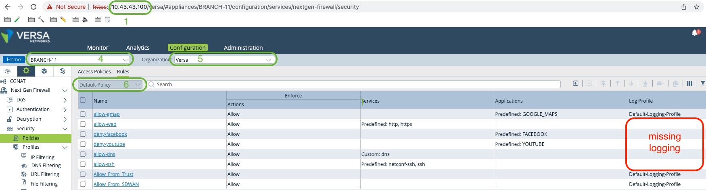
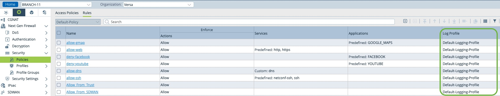

## Purpose of the script
- access-rules-edit.py : The script will inspect every access rules on a CPE and check if logs & logs profiles are enable. If not it can proceed with 3 differents actions:
1) Diplay the rule in the terminal.
2) Enable log in the rule.
3) Enable the Default-Logging-Profile in the rule.

## Installation and Dependencies
You will need python3 as well as differents python package. They can be installed locally with pip3
```
pip3 install json
pip3 install requests
pip3 install urllib3
pip3 install argparse
```

## How does it work ?
Before you get started make sure you have the following information:
1) The IP address of the Director where the CPE is managed.
2) The Director Administrator login ( Default is Administrator)
3) The Director Administrator password ( Default is versa123 )
4) The name of the CPE where the change ( or rule review ) is required.
5) The name of the organization where the CPE is managed
6) The name of the Access Policy group where the rules are located ( Default is Default-Policy )



Worse case execute the script with the --help flag to remind you how it works.
```
% python3 access-rules-edit.py --help
usage: access-rules-edit.py [-h] [--ip IP] [--device DEVICE] [--org ORG] [--group GROUP] [--user USER] [--password PASSWORD] [--action ACTION]

Script to change the log settings of a VOS CPEs accross ALL its access policies

optional arguments:
  -h, --help           show this help message and exit
  --ip IP              IP address of Director
  --device DEVICE      Branch Device name
  --org ORG            Organization name
  --group GROUP        Policy Group Name
  --user USER          GUI username of Director
  --password PASSWORD  GUI password of Director
  --action ACTION      Action to be taken on the offending rules (display / set-log / set-log-profile)
```
   
Once you have the information, you can decide to display the rules where log settings( and log-profile ) are missing
```
sly@MacBook versa-policy % python3 access-rules-edit.py --user Administrator --password versa123 --ip 10.43.43.100 --device BRANCH-11 --org Versa --group Default-Policy --action display
--> allow-web has NO log enable
--> allow-web has NO log profile
--> deny-facebook has NO log enable
--> deny-facebook has NO log profile
--> deny-youtube has NO log enable
--> deny-youtube has NO log profile
--> allow-dns has NO log enable
--> allow-dns has NO log profile
--> allow-ssh has NO log enable
--> allow-ssh has NO log profile
```

At this stage, you can confirm that you want to set the log knob on each rule where it's missing.
```
sly@MacBook versa-policy % python3 access-rules-edit.py --user Administrator --password versa123 --ip 10.43.43.100 --device BRANCH-11 --org Versa --group Default-Policy --action set-log
--> setting log on rule allow-web
--> setting log on rule deny-facebook
--> setting log on rule deny-youtube
--> setting log on rule allow-dns
--> setting log on rule allow-ssh
```

And also set a the default log profile so logs get sent to Director for monitoring..
```
sly@MacBook versa-policy % python3 access-rules-edit.py --user Administrator --password versa123 --ip 10.43.43.100 --device BRANCH-11 --org Versa --group Default-Policy --action set-log-profile
--> setting log profile on allow-web
--> setting log profile on deny-facebook
--> setting log profile on deny-youtube
--> setting log profile on allow-dns
--> setting log profile on allow-ssh
```

At the end you should get the following result in the Director WebUI. 


Congrat you just saved yourself 5 min of your precious time :)
