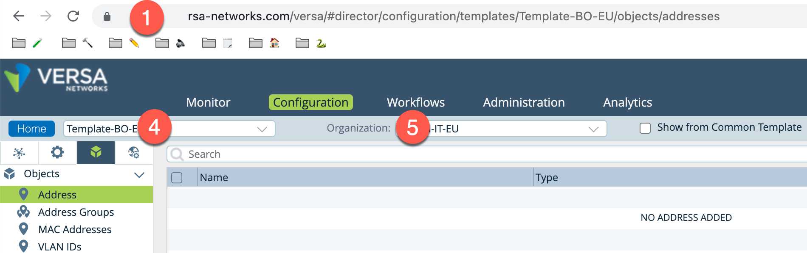

## Purpose of the scripts
The scripts on this repository can create service & address objects on Versa Director from a CSV file. 
You can use the CSV files provided on this page ( ```service-create.csv``` and ```address-create.csv``` ) and populate them with your own objects.


## Installation and Dependencies
You will need python3 as well as differents python package. They can be installed locally with pip3
```
pip3 install json
pip3 install requests
pip3 install urllib3
pip3 install argparse
```

## How does it work ?
Before you get started make sure you have the following information:
1) The IP address of the Director where the CPE is managed.
2) The Director Administrator login ( Default is Administrator).
3) The Director Administrator password.
4) The name of the Template or CPE where your want to create those rules
5) The name of your organization.



One you have the settings above, you can use the script as described below :

Example 1: Use the CSV file service-create.csv to create service on the device office-eu located in the Organization Versa
```
% python3 service-create.py --user Administrator --password=xxxx --target device:office-eu --csv_file rules-create-10.csv --org Versa --ip director-ip.my-domain.com

[->] service TCP-80_90 for device office-eu was created with status code 201
[->] service TCP-0-1024 for device office-eu was created with status code 201
[->] service TCP-82-83-100 for device office-eu was created with status code 201
[->] service www for device office-eu was created with status code 201
[->] service ssl for device office-eu was created with status code 201
[->] service UDP-85 for device office-eu was created with status code 201
[->] service UDP-86 for device office-eu was created with status code 201
[->] service UDP-87 for device office-eu was created with status code 201
[->] service TCP-UDP-88 for device office-eu was created with status code 201
[->] service TCP-UDP-89 for device office-eu was created with status code 201
...
```

Example 2: Use the CSV file address-create.csv to create address & address group on the template Template-OF-EU located in the Organization Versa  --ip director-ip.my-domain.com
```
% python3 address-create.py --user Administrator --password=xxxx --target device:Template-OF-EU --csv_file rules-create-10.csv --org Versa --ip

[->] address 10.190.0.0_24 for template Template-OF-EU was created with status code 201
[->] address 10.191.0.0_24 for template Template-OF-EU was created with status code 201
[->] address 10.192.0.0_24 for template Template-OF-EU was created with status code 201
[->] address 10.193.0.0_24 for template Template-OF-EU was created with status code 201
[->] address 10.194.0.0_24 for template Template-OF-EU was created with status code 201
[->] address 10.195.0.0_24 for template Template-OF-EU was created with status code 201
[->] address 10.196.0.0_24 for template Template-OF-EU was created with status code 201
[->] address 10.197.0.0_24 for template Template-OF-EU was created with status code 201
[->] address 10.198.0.0_24 for template Template-OF-EU was created with status code 201
[->] address 10.199.0.0_24 for template Template-OF-EU was created with status code 201
[->] address group GROUP_1 for template Template-OF-EU was created with status code 201
[->] address group GROUP_2 for template Template-OF-EU was created with status code 201
[->] address group GROUP_3 for template Template-OF-EU was created with status code 201
[->] address group GROUP_4 for template Template-OF-EU was created with status code 201
[->] address group GROUP_5 for template Template-OF-EU was created with status code 201
...
```

   
## How to use the Help command

You can execute the script with the ```--help``` flag to help you with the syntax.

```                                                                        
% python3 service-create.py --help                                                               
usage: service-create.py [-h] [--ip IP] [--target TARGET] [--org ORG] [--user USER] [--password PASSWORD] [--csv_file CSV_FILE]

Script to load services from a CSV file

optional arguments:
  -h, --help           show this help message and exit
  --ip IP              IP address of Director (default: xxxx.versa-networks.com)
  --target TARGET      Device (device:XXX) or Device Template (template:XXX) where the service must be created. (default: device:BRANCH-11)
  --org ORG            Organization name (default: Versa)
  --user USER          GUI username of Director (default: Administrator)
  --password PASSWORD  GUI password of Director (default: xxxx)
  --csv_file CSV_FILE  CSV File including the services (default: service-create.csv)
 ```